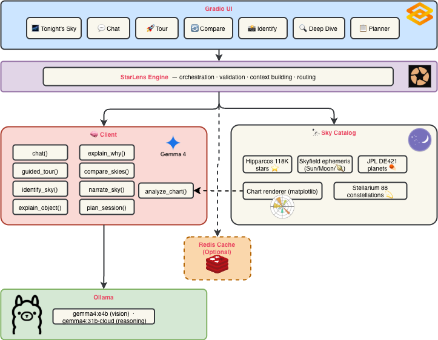

# 🔭 StarLens — Gemma 4 Night Sky Companion

**Your AI-powered stargazing assistant where Gemma 4 is the protagonist — identifying, narrating, guiding, reasoning, and conversing about the sky, all grounded in real NASA/JPL ephemeris data.**

StarLens doesn't just "use" Gemma 4 — every feature flows through Gemma's intelligence. It's not a sky app with AI bolted on; it's an AI astronomy companion that happens to know the real positions of every object above you.


---

## Why Gemma 4?

StarLens showcases **7 distinct Gemma 4 capabilities** — more than any other feature uses in isolation:

| Gemma 4 Capability          | How StarLens Uses It                                                                   |
|-----------------------------|----------------------------------------------------------------------------------------|
| **Multimodal Vision**       | Identify objects in uploaded sky photos AND analyze rendered sky charts (round-trip)   |
| **128K Context Window**     | Load the entire Hipparcos star catalog for deep astronomical reasoning                 |
| **Multi-Turn Conversation** | Interactive sky chat with full ephemeris context — ask anything about what's above you |
| **Structured Reasoning**    | "Why is this object here?" — explains orbital mechanics, seasons, and geometry         |
| **Narrative Generation**    | Guided sky tours with step-by-step directions and surprising facts                     |
| **Temporal Reasoning**      | Compare sky states across time — "what changes in 3 hours?"                            |
| **Cross-Validation**        | Cross-reference AI identifications with computed ephemeris positions                   |

### Intentional Model Selection

StarLens uses **two Gemma 4 variants** for different tasks:

- **`gemma4:e4b`** — Fast multimodal identification (vision tasks, low latency)
- **`gemma4:31b-cloud`** — Deep reasoning with full star catalog context (128K window, chat, tours)

Users can switch models in the sidebar based on their hardware.

---

## Features

### 💬 Interactive Sky Chat *(NEW — Gemma as Protagonist)*

Talk to Gemma 4 about the sky — it has your real-time ephemeris loaded:

- "What's that bright thing in the south?" → Gemma checks computed positions
- "Tell me more about that constellation" → multi-turn conversation with memory
- Full sky state injected as system context — zero hallucination
- Gemma reasons from real NASA/JPL data, not training data

### 🚀 Gemma-Guided Sky Tour *(NEW — Gemma as Protagonist)*

Gemma 4 leads you through the sky step-by-step:

- Each stop: exact direction, altitude, what you'll see, why it's amazing
- "Next" button progression — like a live planetarium show
- 3-8 customizable stops based on tonight's visible objects
- Surprising facts and smooth transitions between stops

### 🔄 Sky Comparison *(NEW — Gemma as Protagonist)*

How will the sky transform over time?

- Side-by-side sky charts (now vs. future)
- Gemma narrates the transformation — what rises, sets, and shifts
- Adjustable 1-12 hour lookahead
- Identifies the best viewing moments

### 🌌 Tonight's Sky *(Enhanced)*

Real-time computation of what's visible from your location right now:

- Planet positions computed from JPL DE421 ephemeris
- Moon phase and position
- Bright named stars with altitude/azimuth
- Constellation visibility percentages
- Beautiful dark-themed sky chart
- **Gemma 4 narration** of the entire scene
- **❓ "Why?" buttons** — tap any object and Gemma explains the orbital mechanics
- **👁️ Multimodal round-trip** — Gemma analyzes its OWN rendered sky chart using vision

### 📸 Identify Photo

Upload a night sky photo and Gemma 4 identifies what's in it:

- Constellation recognition
- Star identification
- Planet detection
- **Ephemeris cross-validation** — Gemma's identifications are checked against real computed positions

### 🔍 Deep Dive

Ask about any celestial object and get a comprehensive explanation:

- Gemma 4 receives the **full star catalog** via 128K context
- Science, mythology, observation tips
- Powered by real astronomical data, not just training data

### 📋 Observation Planner

Gemma 4 creates an optimized stargazing plan:

- Best viewing times based on twilight computation
- Object priority by visibility window
- Equipment recommendations
- Personalized to your preferences

---

## Architecture



**Key design decisions:**

- All AI goes through `gemma.py` — Gemma 4 is the sole intelligence (9 methods)
- All astronomy goes through `catalog.py` — real science, not hallucination
- `engine.py` orchestrates both, builds context, and cross-validates results
- **Multimodal round-trip**: the chart renderer produces sky maps that are fed BACK to Gemma 4's vision for analysis — proving Gemma can both consume and reason about astronomical data

---

## Setup

### Prerequisites

- Python 3.10+
- [Ollama](https://ollama.com/) with Gemma 4 pulled:

```bash
ollama pull gemma4:e4b
# or for deeper reasoning:
ollama pull gemma4:31b-cloud
```

### Install

```bash
git clone https://github.com/imjoseangel/starlens.git
cd starlens
python -m venv .venv
source .venv/bin/activate
pip install -e .
```

### Data Files

StarLens needs three astronomy data files in the `app/data/` directory:

- `de421.bsp` — JPL planetary ephemeris (auto-downloaded by Skyfield if missing)
- `hip_main.dat` — Hipparcos star catalog (auto-downloaded by Skyfield if missing)
- `constellationship.fab` — Stellarium constellation outlines ([download](https://github.com/Stellarium/stellarium/blob/master/skycultures/modern/constellationship.fab))

Skyfield will download the first two automatically on first run.

### Run

```bash
python app/main.py
```

Open <http://localhost:8000> and start exploring the night sky!

---

## Project Structure

```text
startlens/
├── app/                        # Application code
│   ├── main.py                 # Gradio UI (7 tabs, Gemma-centric)
│   ├── assets/
│   │   └── gemma_logo.png      # Gemma 4 branding
│   ├── data/
│   │   ├── de421.bsp           # JPL ephemeris
│   │   ├── hip_main.dat        # Hipparcos catalog
│   │   └── constellationship.fab # Constellation lines
│   └── starlens/
│       ├── __init__.py
│       ├── gemma.py            # Gemma 4 client (9 AI methods)
│       ├── catalog.py          # Sky catalog (Skyfield + Hipparcos)
│       ├── chart.py            # Sky chart renderer (matplotlib)
│       ├── engine.py           # Orchestrator (catalog + Gemma)
│       ├── cache.py            # Redis caching layer
│       └── settings.py         # pydantic-settings configuration
├── Dockerfile
├── docker-compose.yml
├── pyproject.toml
├── .env.example
├── LICENSE
└── README.md
```

---

## How It Works

1. **Sky Computation**: Skyfield computes real-time positions of 118,000 stars, 8 planets, Sun, and Moon using NASA/JPL ephemeris data — accurate to arcsecond precision.

2. **Context Injection**: The computed sky data is serialized and injected into every Gemma 4 call as system context — this means Gemma reasons from real data, not hallucination.

3. **Interactive Chat**: Users can talk to Gemma naturally — "What's that bright star?" — and Gemma looks up the real computed positions to answer accurately with multi-turn memory.

4. **Guided Tours**: Gemma generates step-by-step sky tours using the visible objects list, telling you exactly where to look with cardinal directions and altitudes.

5. **Multimodal Round-Trip**: StarLens renders a sky chart from ephemeris data, then feeds it BACK to Gemma 4's vision model — proving Gemma can both consume and analyze astronomical visualizations.

6. **"Why?" Reasoning**: For any visible object, Gemma explains the orbital mechanics, seasonal geometry, and celestial mechanics behind its current position.

7. **Sky Comparison**: Gemma receives two sky snapshots (now vs. future) and narrates the transformation — what rises, sets, and shifts.

8. **Cross-Validation**: When analyzing photos, the engine cross-references Gemma's identifications against computed ephemeris positions — confirming which identifications are astronomically accurate.

---

## Built With

- **[Gemma 4](https://ai.google.dev/gemma)** — Google's multimodal AI model (12B and 27B variants)
- **[Ollama](https://ollama.com/)** — Local model inference
- **[Skyfield](https://rhodesmill.org/skyfield/)** — Astronomical ephemeris computation
- **[Hipparcos](https://www.cosmos.esa.int/web/hipparcos)** — ESA star catalog (~118,000 stars)
- **[Gradio](https://www.gradio.app/)** — Interactive web UI with dark astronomy theme
- **[Matplotlib](https://matplotlib.org/)** — Sky chart rendering

---

## License

MIT

---

*Built for the [DEV.to Gemma 4 Challenge](https://dev.to/devteam/join-the-gemma-4-challenge-3000-prize-pool-for-ten-winners-23in) — Build category*
